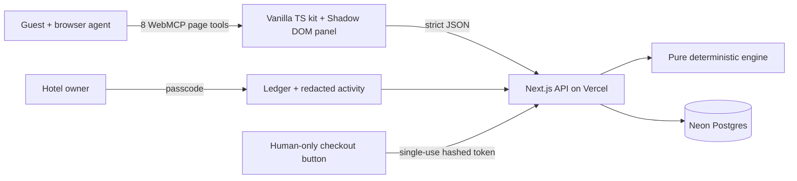

# Parley

[](https://github.com/bpais88/Parley/actions/workflows/ci.yml)

**Negotiable direct booking for the agentic web.**

[Parley for hotels](https://parleywebmcp.vercel.app) · [Live hotel](https://parleywebmcp.vercel.app/demo) · [Owner ledger](https://parleywebmcp.vercel.app/owner) · [RFC](https://parleywebmcp.vercel.app/docs/rfc) · [Level 0](https://parleywebmcp.vercel.app/docs/level0)

Owner demo passcode: `parley-demo-2026`

Hotels pay meaningful commission to online travel agencies because their own websites were never places where a guest's agent could act. Parley adds one small script to the hotel page. The browser agent sees the stay the guest sees, holds live inventory, and negotiates with a deterministic hotel policy. The avoided commission funds a better guest deal, a higher hotel net, and a small platform fee. **Acceptance stays out of the tool surface and in the human's visible checkout.**

## Try it in under three minutes

Open the [demo hotel](https://parleywebmcp.vercel.app/demo) in the ChatGPT desktop app's built-in browser with a WebMCP-enabled model, then ask:

> Team offsite: five single rooms, 24–27 September 2026. Budget €1,600 all-in. We want breakfast and late checkout Sunday. Don't book—get me the best deal and tell me the trade-off.

The expected path is `set_dates` → `search_availability` → `hold_rooms` → `request_offer` → `counter_offer` → `get_offer_status`. The first offer is €1,650 room charges (€1,680 with city tax); the counter lands at €1,530 room charges (€1,560 all-in), prepaid and non-refundable, with both perks. The agent should stop and tell the guest to use **Accept & pay** in the panel.

Two shorter prompts:

> What stay is currently selected on this page, and is there an active offer?

> I already have a refundable Booking.com reservation for these dates at €120 per night, cancellable in six days. Can this hotel beat it? Do not cancel anything.

Every flow also works by clicking the panel with no agent present.

Hotel owners can also open the [Parley homepage](https://parleywebmcp.vercel.app) with their agent. A separate ten-tool onboarding surface explains the product, estimates recoverable commission, fills the shared hotel profile, turns plain-language preferences into visible rule fields, sets a consent-based reservations inbox, and reveals a copy-ready starter file or install snippet. The agent may prepare the pilot form, but cannot consent, submit enrollment, publish code, contact a guest, or activate a hotel; those remain visible human actions.

A hotelier can simply say:

> On quiet dates, offer breakfast and late checkout before lowering the price. Never leave me worse off than an OTA booking. Ask me above eight rooms, require prepayment for the deepest discounts, and send guest enquiries to reservations@ourhotel.com—but ask the guest first.

The shared page turns that into reviewable numeric floors, discount limits, perks, group escalation, prepayment, voice, and an enquiry inbox. Those settings are stored with the human-approved pilot request. Guest messaging is not sent until the property is activated, and the configured contact policy always requires an explicit guest yes.

## Why WebMCP

The agent and guest share the same page, state, and visual feedback. `set_dates` moves the date fields the guest sees; holding rooms starts the same countdown; offers appear in a timeline with separate **Your agent** and **Casa do Zêzere · policy** identities. A server-side MCP would not naturally inherit the page the guest chose or expose each action in that shared interface. Visiting the hotel URL is enough to discover its capabilities.

Parley registers eight imperative page tools from top-level JavaScript:

| Tool | Effect |
|---|---|
| `get_stay_context` | Reads the visible stay, hold, and offer |
| `set_dates` | Updates the shared stay picker |
| `search_availability` | Reads live inventory and rate totals |
| `hold_rooms` | Places a 15-minute inventory hold |
| `request_offer` | Opens a deterministic negotiation |
| `counter_offer` | Submits one price counter |
| `get_offer_status` | Reads round, expiry, and human-only boundary |
| `get_booking` | Reads a visitor-bound confirmation |

There is deliberately no accept, pay, card, or cancellation tool.

## Worked economics

Five Standard rooms for three nights have a €1,650 rack total. At 20% OTA commission, the hotel would net €1,320. After a prepaid counter, Parley offers €1,530 with breakfast and late checkout. The ledger is exact integer-cent math:

| Item | Amount |
|---|---:|
| Guest room total | €1,530.00 |
| In-kind breakfast cost | −€90.00 |
| Parley fee (3%) | −€45.90 |
| Hotel direct net | €1,394.10 |
| Hotel net through OTA | €1,320.00 |
| **Hotel uplift** | **+€74.10** |

The guest saves €120 on rooms and receives €255 of correctly unitized perk value. City tax (€30) is disclosed separately and is not negotiated.

## Architecture



Next.js on Vercel keeps the hotel demo, owner UI, API, cron and docs in one reliable deploy; Neon provides serverless Postgres with migrations in the repository. The vanilla TypeScript kit is a 22.7 KB IIFE (7.8 KB gzipped), so it is appropriate for a third-party hotel page. The negotiation engine has no LLM, I/O, clock, or randomness. This reduced hackathon build intentionally serves both the site and kit from Vercel; Cloudflare distribution, Netlify cross-host deployment, email fallback, and OpenAI policy parsing were cut before implementation rather than claimed without proof.

## Safety model

- Tools use strict JSON Schemas; shared Zod schemas are the runtime source of truth.
- All money is integer cents, room-night offers are rounded upward to whole euros, property dates are `YYYY-MM-DD`, and expiries are UTC.
- A Postgres advisory lock serializes availability rechecks and hold creation to prevent overselling.
- Checkout tokens are visitor/session-bound, stored as SHA-256 hashes, short-lived, and single-use.
- The visible demo form collects name and email only. It has no card fields and processes no payment.
- Booking lookup is bound to the visitor cookie and never returns guest PII.
- Tool activity recursively redacts name, email, and card-like fields.
- The debug shim is available only on localhost with `?debug=1`.

## What is real and what is mocked

Real: deployed WebMCP registration and invocation, shared UI state, deterministic negotiation, hosted Postgres inventory and holds, visitor-bound sessions, offer expiry, confirmation records, economic ledger, owner passcode, redacted activity, cron declarations, Level 0 discovery, and consented storage of pilot rules and inbox preferences.

Demo-only: Casa do Zêzere and its inventory are fictional seeded data; checkout makes no charge; there is one room type and one currency. PMS/channel-manager connectivity, production payments, staff authentication, multi-property support, delivery of guest enquiries to the configured external inbox, email fallback, and OTA cancellation are not built. The [integration note](https://parleywebmcp.vercel.app/docs/integration) explains how an existing booking engine remains the payment and inventory authority.

## Repository

```bash
pnpm install
pnpm typecheck
pnpm lint
pnpm test
pnpm e2e
pnpm build:kit
pnpm build
```

Database setup requires `DATABASE_URL`, followed by `pnpm db:migrate` and `pnpm seed`. Production also uses `OWNER_PASSCODE` and `CRON_SECRET`. See [`DECISIONS.md`](./DECISIONS.md) for every material scope or implementation decision and [`TESTLOG.md`](./TESTLOG.md) for observed gates and failures.

The submission's deliberate cuts, demo boundaries, and production follow-up are collected in [`docs/HACKATHON-TRADEOFFS.md`](./docs/HACKATHON-TRADEOFFS.md).

## Test matrix

| Layer | Evidence |
|---|---|
| Engine and schemas | 31 Vitest tests overall; exact worked example, floors, bands, perks, monotonicity, round cap, rebook guards |
| Tool contract | Eight hotel tools plus ten landing-page onboarding tools; unique names, strict schemas, annotations, description quality, forbidden-action checks |
| Browser E2E | Agent-shim sequence, clicks-only checkout, owner +€74.10 ledger assertion |
| Hosted integration | Real availability → hold → offer → counter → token → confirm → booking → owner ledger against Neon |
| WebMCP runtime | Deployed page tools discovered and directly invoked in the in-app browser; final Sol/Terra prompt screenshots remain in `TESTLOG.md` until observed |

MIT licensed. See [`LICENSE`](./LICENSE).
